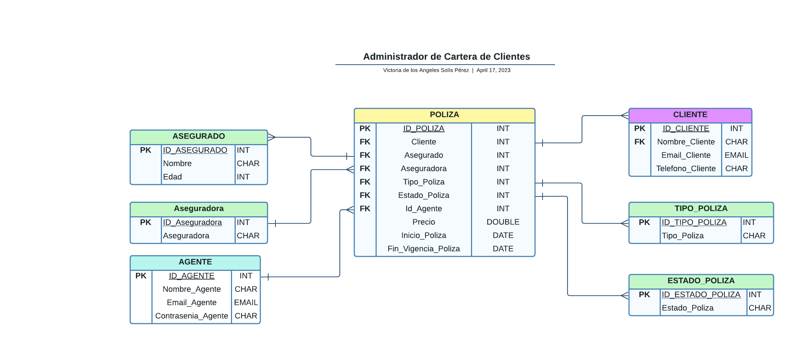

# Administrador Cartera de Clientes

El administrador de cartera de clientes es una api que permite a los agentes de seguros, adminitrar a sus asegurados y clientes. 


## Modelo de la BD

El modelo relacional utilizado para la creación de los módelos, se puede ver en la imagen: 



## Instalación

Para la instalación, se requiere clonar el proyecto e instalar los paquetes que se encuentran en requeriments.txt con el comando: 

#### pip install -r requirements.txt

Adicionalmente, es necesario verificar que los siguientes módulos se encuentren instalados: 

* drf-yasg
* rest_framework
* django

Para ello se puede hacer uso de los comandos:

```
pip freeze
pip show

```


## Run Local

Para poder utilizar la api, se necesita iniciar el servidor con: 

```
  python manage.py runserver
```


## Rutas a utilizar

Al inicializar el servidor, aparecerá una ruta similar a: 


En donde se debe agregar alguna de las siguientes rutas: 

* api/agente/
* api/poliza/
* api/asegurado/
* api/aseguradora/
* api/poliza/
* api/estado_poliza/
* api/tipo_poliza/

Estas permitiran ver, en un formato json, lo que contiene la tabla utilizada. 

En caso de querer *agregar datos*, debajo se encuentra un formulario en donde se puede rellenar y solo se necesitas dar click en el botón **POST** para agregarlos. 

En caso de querer acceder a un *dato concreto*, solo se requiere escribir el id después de la ruta. 

Es decir: 

```
api/agente/1/
```

**Importante:** Se requiere escribir un **/** al final de las rutas, de lo contrario es posible que aparezca la leyenda **"Página no encontrada"**


## Servicio de Creación de Poliza


En caso de requerir **Crear una poliza**, se accede a la ruta: 

```
api/poliza/
```

Y se rellenan los datos como se ve en la imagen: 


**Nota:** En caso de no encontrar datos para seleccionar en los apartados, se requiere escribir los datos de nuevo en la BD.

Esto puede hacerse mediante las rutas documentadas arriba, solo rellenando y dando click al botón **POST**


## Adicional: Servicio de Login, buscando la contraseña de un agente

Para utilizarlo, se necesita de la contraseña de un agente. 

Estas pueden visualizarse al utilizar el método get en la url. 

Para encontrar el usuario con la contraseña, la ruta debe verse:

```
api/agente/28210/
```

Donde 28210 es la contraseña mencionada, quien puede contener tanto letras como números.

## Sobre la API

La API se creó pensando en utilizar los métodos GET, POST, PUT Y DELETE. 

Por tanto, si se utiliza algún cliente como POSTMAN o Thunder Client en Visual Studio Code, se puede acceder a dichos métodos y verificar los usos de: 

* Ver toda la información de una tabla
* Ver la información de un id que se encuentre en la tabla seleccionada
* Agregar datos
* Actualizar datos
* Borrar datos

### Método GET

Para usarlo, basta con el navegador y agregar las rutas dichas con anterioridad. 

Por ejemplo: 

```
  /api/agente/
```

Traerá los datos de los Agentes

Mientras que: 

```
api/agente/2/
```

Traerá los datos del agente con el id 2


### Método POST

Se dijo con anterioridad como utilizarlo, solo se necesita alguna de las rutas proporcionadas, rellenar los dato correspondiente y dar click en el botón **POST**


### Método PUT

Para utilizar el métodos de modificación se necesita de la ruta, el id del elemento a modificar y rellenar un json. 

La ruta debe verse: 

```
api/agente/2/
```

En donde puede verse un formulario y un botón llamado **PUT** al final del mismo. Con ello se puede modificar la información del agente con el id proporcionado

### Método DELETE

Para utilizar el métodos de eliminación se necesita de la ruta y el id del elemento a eliminar

La ruta debe verse: 

```
api/agente/2/
```

Dentro de la ruta se encuentra un botón con el nombre DELETE, al presionarlo se borrará el elemento. 
 

## Pruebas Unitarias

Las pruebas unitarias pueden ejecutarse mediante el comando:

```
  python manage.py test
```

En este caso, se crearon 4 para probar la funcionalidad de los métodos GET, POST, PUT y DELETE de los Agentes. 


## Documentación con Swagger

Para acceder a la documentación con Swagger se debe acceder a la ruta: 

```
  /docs/
```

En la imagen se muestra como debe verse: 


